<p align="center">
  
</p>

<h1 align="center">DriveIQ</h1>

<p align="center"><b>Intelligent vehicle management.</b> Track maintenance and reminders, import CARFAX history, and ask questions about your vehicle — answered from its actual owner's manual with RAG. Full-stack and local-first.</p>

<p align="center">
  <a href="https://github.com/ry-ops/DriveIQ/releases"></a>
  <a href="https://www.python.org/downloads/"></a>
  
  
  
  <a href="LICENSE"></a>
</p>

---

## What it does

- 🧰 **Maintenance log** — oil changes, tire rotations, brake service, with cost tracking and receipt/PDF uploads.
- ⏰ **Smart reminders** — date- and mileage-based, with recurring support.
- 📄 **Service records** — import CARFAX reports; track complete history.
- 📊 **Dashboard** — mileage, maintenance forecast, CARFAX value estimate.
- 🤖 **Ask your vehicle** — a floating chat answers questions from the owner's manual, QRG and your records, with source citations. "Ask about this" pre-fills contextual questions from any maintenance record.

## Architecture

<p align="center">
  
</p>

| Layer | Technology |
|---|---|
| Frontend | React 18, TypeScript, Vite, Tailwind, TanStack Query |
| Backend | FastAPI, Python 3.11+, SQLAlchemy, Pydantic |
| Database | PostgreSQL 15+ with pgvector |
| Vector DB | Qdrant (optional, high-performance search) |
| Cache | Redis (LLM responses, embeddings, sessions, rate limiting) |
| AI | Docker Model Runner (local LLM) + sentence-transformers embeddings |

**Local-first:** the AI runs on a local model by default, so your vehicle data and documents stay on your machine. (Set `ANTHROPIC_API_KEY` to use Claude instead.)

## Quick start

```bash
git clone https://github.com/ry-ops/DriveIQ.git
cd DriveIQ
cp .env.example .env          # set DB creds, security keys, AI options

docker compose up            # frontend · backend · Postgres · Redis · model runner
```

Put your owner's manual and guides as PDFs in `/docs`, then reindex from the dashboard to make them searchable. For a from-source setup (Postgres, backend, frontend) see the Quick Start and [`CLAUDE.md`](CLAUDE.md).

## How the AI works

Your documents are chunked and embedded into pgvector (or Qdrant). When you ask a question, DriveIQ retrieves the most relevant passages and the local LLM answers **with the source shown** — the manual page, QRG section, or service record it drew from. Responses are cached in Redis.

## More

API endpoints, the database schema, the AI architecture and deployment are documented in [`docs/`](docs/) and the sections of this repo's wiki-style guides. There's also an MCP server under [`mcp/`](mcp/) and a Docker Desktop extension under [`docker-extension/`](docker-extension/).

## License

MIT. See [LICENSE](LICENSE).

<!-- org-footer -->
---

<p align="center"><sub>Part of <a href="https://github.com/ry-ops">ry-ops</a> · building the pipes between infrastructure, automation, and observability · built by <a href="https://github.com/ry-ops">ry-ops</a></sub></p>
